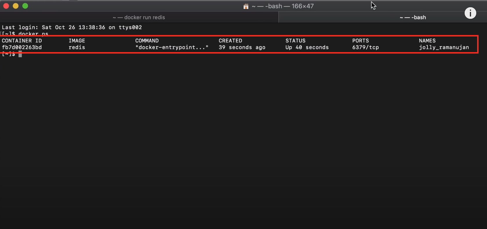
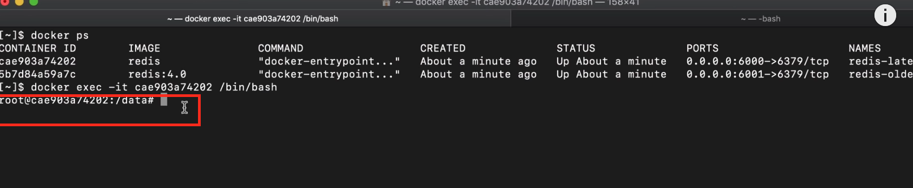

# Docker container
## Get started
1. [Install](https://docs.docker.com/desktop/install/mac-install/) Docker on your computer.
2. Create a Hub account to allocate a remote storage.

## Docker commands
Once docker is installed on your computer, you will be able to use the Docker commands.
If we don't specify the version number, docker will automatically pull the latest available version.
This command will download the image from docker Hub locally, and later you will be able to run it.

1.     docker pull name_of_docker_image: version_number 

Check all the existent images on my computer as a docker images:
2.     docker images 

Create a container of the name_of_docker_image that will make it 
possible to connect to the name_of_docker_image application.
3.     docker run -p host_port_number:image_port_number -d name_of_docker_image: version_number  --name container_name

If we didn't do 'pull' image before the run command, it will automatically 'pull' and 'run' the image.

-d option means in detached mode. The container will be running in a detached mode and the terminal is still usable.
But in attached mode the terminal will be allocated for the session created when the container is running and the 
terminal will not be usable, and we need to open new terminal to continue working with command line.

-p host_port_number:image_port_number option: If we want to create a binding between the application 
(docker container) and your localhost we need to specify two ports. The first port should be
an available port in the localhost.

--name option will allocate the container_name to the current container instead of assigning a random name.

Get the list of all the running docker containers.
4.     docker ps -a

-a option: to get the history of all the stopped and running containers.

To stop a specific container using the container ID.
5.     docker stop container_id

To start a specific container using the container ID
6.     docker start container_id

This is a command for troubleshooting. When something goes wrong in the container. 
7.     docker logs container_name  or docker logs container_id

When we want to get inside the container.
8.     docker exec it container_id /bin/bash

Get the terminal and execute some command on it.

## How to use the container in you host computer: localhost
A Docker container has an open port to communicate with website or with localhost.
To make use of the container with our localhost, we need to create so-called binding between
the container open port with a randomly chosen available port of our localhost.