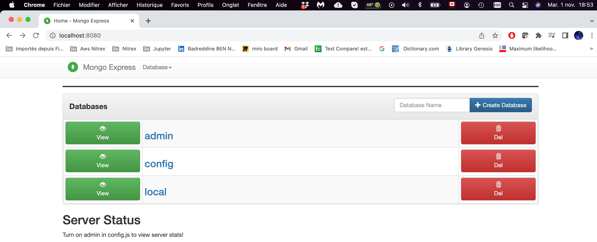

# Docker demo project
Developing with container. Docker in a Software development. 
How to work with Docker containers when developing applications.
## How to use docker in a local development process
1. Develop very simple UI backend application using Javascript.
2. Develop very simple HTML structure and node JS in the backend.
3. In order to integrate all of these in a database, we create a Docker container 
of a MongoDB
4. To make use of the MongoDB much easier, so we create a Docker container 
of a Mongo UI which is called MongoExpress. Where we can see the database structure and all the updates
that our application is making in the database.
5. To connect MongoExpress to MongoDB, we need to create a network and connect each other to it.
### Create and connect MongoDB with MongoExpress

#### Create a Docker network for the database(MongoDB) and the UI (MongoExpress)

    docker create mongo-network

#### Create a MongoDB container
    docker run -d \ \
    -p 27017:27017 \ \
    -e MONGO_INITDB_ROOT_USERNAME=admin \ \
    -e MONGO_INITDB_ROOT_PASSWORD=password \ \
    --net mongo_network \ \
    --name mongodb \ \
    mongo

#### Create a MongoExpress container
    docker run -d \ \
    -p 8080:8080 \ \
    -e ME_CONFIG_MONGODB_ADMINUSERNAME=admin \ \
    -e ME_CONFIG_MONGODB_ADMINPASSWORD=password \ \
    --net mongo_network \ \
    --name mongo-express \ \
    -e ME_CONFIG_MONGODB_SERVER=mongodb \ \
    mongo-express
#### Open mongo-express from browser

    http://localhost:8080

#### To build a docker image from the application

    docker build -t my-app:1.0 .       
    
The dot "." at the end of the command denotes location of the Dockerfile.

# Docker compose
Docker compose is used to run multiple container at the time.
